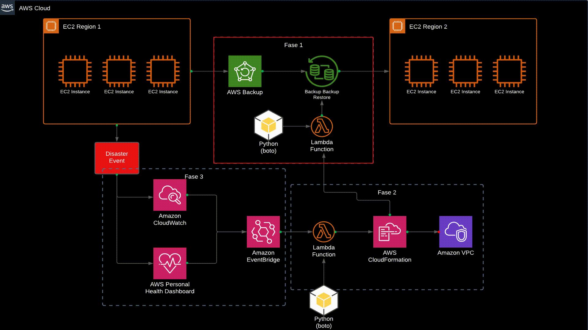
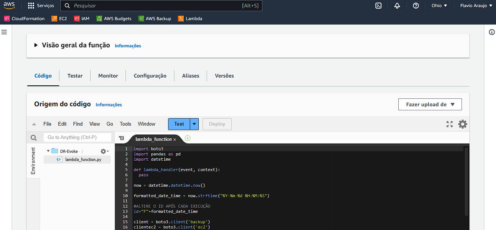

# DR_plan_AWS
Meu projeto se concentra em automatizar uma recuperação automática de Datacenter EC2 em caso de desastres, o que pode ser crucial na redução do RTO que é uma métrica importante para a eficiência de um plano de recuperação de desastres.

Foram utilizados AWS Backup, AWS Lambda, CloudWatch, CloudFormation, EC2, IAM, S3, VPC, EventBridge, AWS SNS e AWS Health.

Plano geral:

Fase 1:
Codar usando o AWS SDK Python afim de automatizar o job de recuperação do AWS Backup. Filtros foram utilizados para listar as VM's e os snapshots necessários.

.gif)

Primeiros testes Fase 1:

Fase 2:
Criar a estrutura IaC de VPC e Security Group usando CloudFormation, necessária para recuperação do datacenter em outra região.

Fase 3:
Afim de garantir segurança no acionamento da automação, a idéia de acionar automaticamente a função lambda através de eventos do EventBridge foi abandonada. No lugar foi adicionado o AWS SNS, mantendo assim os responsáveis pela infra informados sobre possível interrupções do serviço EC2. O Acionamento agora se dá por invocação da função e só deve acionada pelo usuário com a permissão correta.

Fase de integração:
Por fim, todas as fases precisaram ser integradas para que trabalhem juntas.